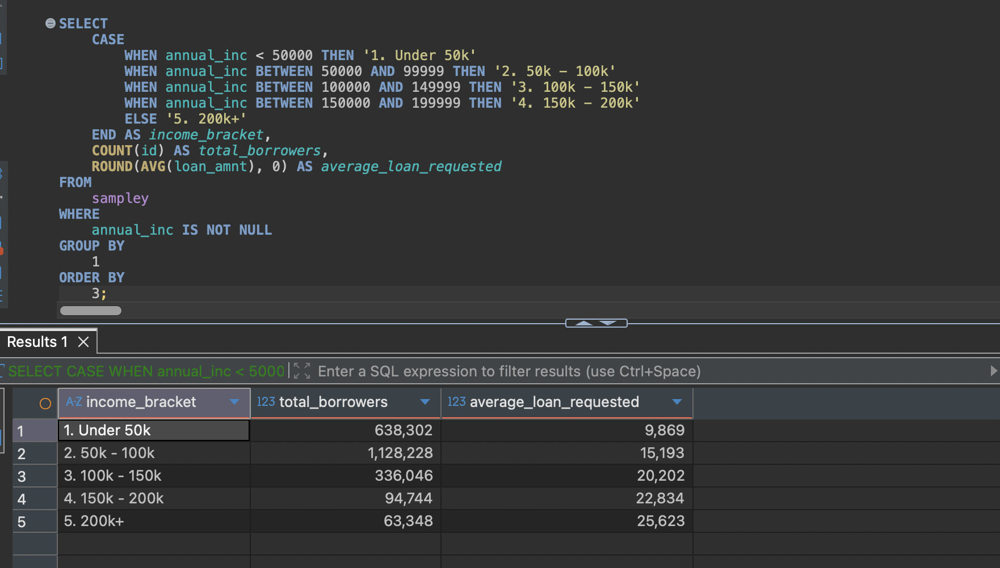
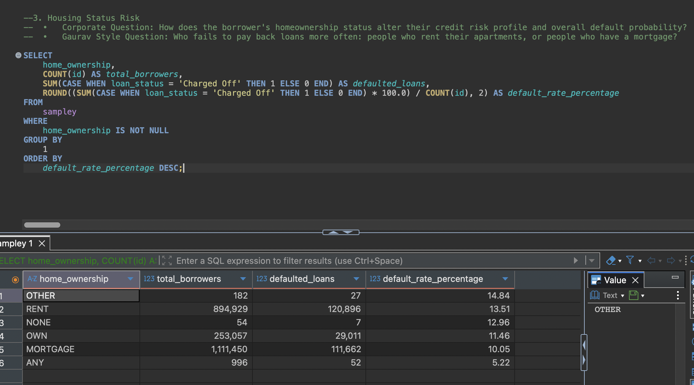
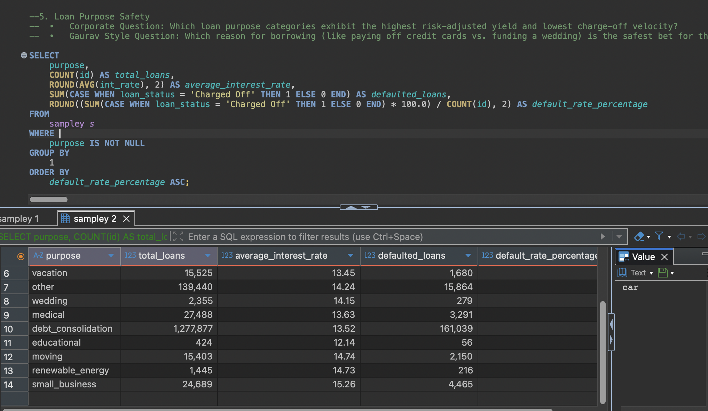
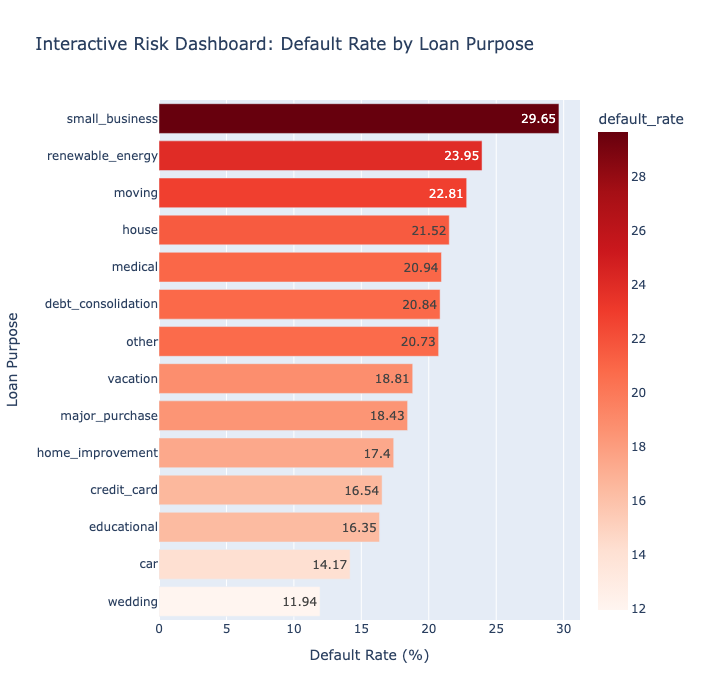

# Consumer Credit Exposure & Portfolio Risk Diagnostics

**Author:** Gaurav Roy  
**Domain:** Consumer Finance & Credit Risk  
**Tech Stack:** Python (Pandas, Seaborn), SQL, Plotly, ipywidgets, Jupyter  

---

## 📌 Executive Summary
This project analyzes a large-scale, real-world consumer credit dataset (approximately 2.26 million historical loan records) to identify the core drivers of default risk. The objective was to move beyond high-level loan volumes and mathematically isolate which borrower attributes and capital allocation categories pose the highest financial threat to the portfolio.

### Key Business Insights:
1. **The Volume vs. Risk Paradox:** While *Debt Consolidation* drives the vast majority of originations, *Small Business* loans exhibit the highest peak charge-off rate (nearly 30%). 
2. **The Income Insulation Myth:** High annual income does not proportionally mitigate default risk. Borrowers in top income tiers defaulted at statistically similar rates to lower tiers due to high debt-to-income leverage.
3. **Collateral Discrepancy:** Renters exhibit a baseline default rate roughly 5% higher than borrowers holding active mortgages, despite borrowing smaller average principal amounts.

---

## 🛠 Phase 1: Data Architecture & SQL Aggregation

Before calculating financial metrics, the dataset required rigorous querying and cleaning to prevent mathematical corruption in down-funnel aggregations. I used SQL logic to segment borrowers into income tiers and calculate baseline volume.

*(Below: SQL Aggregation grouping total borrowers and average loan requested by custom Income Brackets)*


*(Below: SQL query isolating default rate percentages based on Home Ownership status)*


---

## 📊 Phase 2: Exploratory Data Analysis (EDA)

I built static visual wireframes using Python (Matplotlib and Seaborn) to establish baseline company metrics before diving into advanced risk percentages.

### 1. Macro Default Rate (The Bottom Line)
Establishing the historical ratio of fully paid principals versus charged-off assets.


### 2. Origination Trajectory (Company Growth)
Mapping year-over-year loan volume to understand periods of hyper-growth versus stabilization.


---

## 📈 Phase 3 & 4: Business Logic & Interactive Dashboard

The final phase transitioned from static visualizations and SQL queries to an interactive data product. Using **Plotly Express** and **ipywidgets**, I engineered a dynamic dashboard that allows stakeholders to filter massive datasets in real-time.

*(Below: SQL logic establishing the risk-adjusted yield and charge-off velocity for specific loan purposes)*


### The Final Deliverable:
The dashboard below utilizes a heatmap gradient to instantly highlight maximum portfolio vulnerabilities based on borrower intent.



---

## 🚀 How to Run This Project Locally

1. **Clone the repository:**
   ```bash
   git clone https://github.com/GauravRoy092/credit_portfolio_exposure.git
   cd credit_portfolio_exposure
   python3 -m venv .venv
   source .venv/bin/activate
   python -m pip install -r requirements.txt
   jupyter lab credit_risk_eda.ipynb
   ```

<!--
2. **Provide the dataset:**

   Place the Lending Club CSV in the project root as `consumer_credit_records.csv`. The dataset is
   intentionally excluded from Git because it is approximately 1.1 GB.
   Download source: https://www.kaggle.com/datasets/adarshsng/lending-club-loan-data-csv?resource=download

3. **Run the SQL analysis:**

   Import `consumer_credit_records.csv` into a table named `sampley` in SQLite or PostgreSQL, then
   run `risk_aggregation_queries.sql`. The SQL uses common functions supported
   by both systems, but date expressions may need adjustment for a different
   database engine.
-->