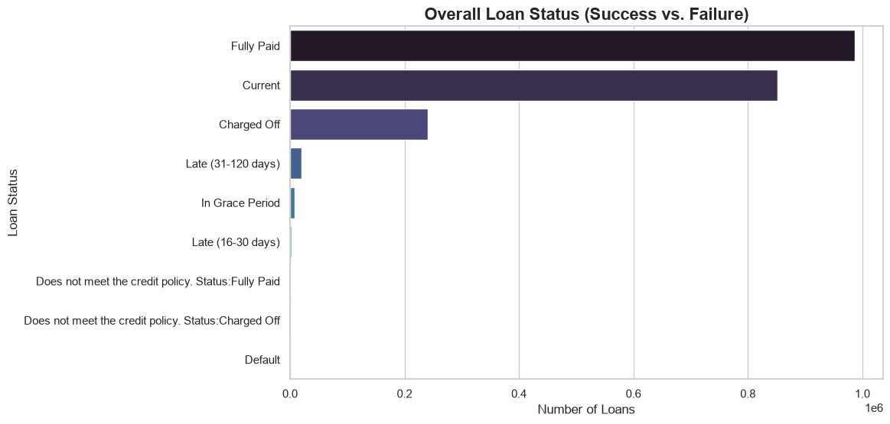
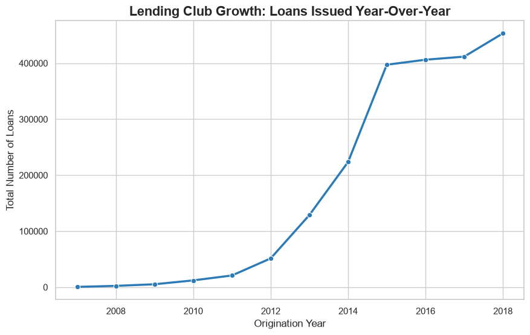

# Lending Club Credit Risk Analysis & Interactive Dashboard

**Author:** Gaurav Roy  
**Domain:** Consumer Finance & Credit Risk  
**Tech Stack:** Python (Pandas, Seaborn), SQL, Plotly, ipywidgets, Jupyter  

---

## 📌 Executive Summary
This project analyzes a large-scale, real-world consumer credit dataset (approximately 2.26 million historical loan records) to identify the core drivers of default risk. The objective was to move beyond high-level loan volumes and mathematically isolate which borrower attributes and capital allocation categories pose the highest financial threat to the portfolio.

### Key Business Insights:
1. **The Volume vs. Risk Paradox:** While *Debt Consolidation* drives the vast majority of originations, *Small Business* loans exhibit the highest peak charge-off rate (nearly 30%). 
2. **The Income Insulation Myth:** High annual income does not proportionally mitigate default risk. Borrowers in top income tiers defaulted at statistically similar rates to lower tiers due to high debt-to-income leverage.
3. **Collateral Discrepancy:** Renters exhibit a baseline default rate roughly 5% higher than borrowers holding active mortgages, despite borrowing smaller average principal amounts.

---

## 🛠 Phase 1: Data Architecture & Sanity (SQL & Python)

Before calculating financial metrics, the dataset required rigorous cleaning to prevent mathematical corruption in down-funnel aggregations.

* **Sparsity Engineering:** Designed programmatic thresholds to drop columns missing >60% of their data (e.g., scrubbed privacy IDs, secondary hardship flags), optimizing memory overhead and computation speed.
* **Target Isolation:** Filtered out in-flight loans ("Current", "In Grace Period") to isolate terminal statuses ("Fully Paid" vs. "Charged Off"), establishing a clean binary `default_flag` variable.

*(Below: Initial data querying and aggregation validation)*


---

## 📊 Phase 2: Exploratory Data Analysis (EDA)

I built static visual wireframes using Matplotlib and Seaborn to establish baseline company metrics before diving into risk percentages.

### 1. Macro Default Rate (The Bottom Line)
Establishing the historical ratio of fully paid principals versus charged-off assets.


### 2. Origination Trajectory (Company Growth)
Mapping year-over-year loan volume to understand periods of hyper-growth versus stabilization.


---

## 📈 Phase 3 & 4: Business Logic & Interactive Dashboard

The final phase transitioned from static visualizations to an interactive data product. Using **Plotly Express** and **ipywidgets**, I engineered a dynamic dashboard that allows stakeholders to filter massive datasets in real-time.

The dashboard below utilizes a heatmap gradient to instantly highlight maximum portfolio vulnerabilities based on borrower intent.


---

## 🚀 How to Run This Project Locally

1. **Clone the repository:**
   ```bash
   git clone https://github.com/yourusername/lending_club_risk_analysis.git
   cd lending_club_risk_analysis
   python3 -m venv .venv
   source .venv/bin/activate
   python -m pip install -r requirements.txt
   jupyter lab lending_dashboard.ipynb
   ```

2. **Provide the dataset:**

   Place the Lending Club CSV in the project root as `loan.csv`. The dataset is
   intentionally excluded from Git because it is approximately 1.1 GB.

3. **Run the SQL analysis:**

   Import `loan.csv` into a table named `sampley` in SQLite or PostgreSQL, then
   run `lending_club_risk_analysis.sql`. The SQL uses common functions supported
   by both systems, but the date expression may need adjustment for a different
   database engine.# lending_club_risk_analysis
